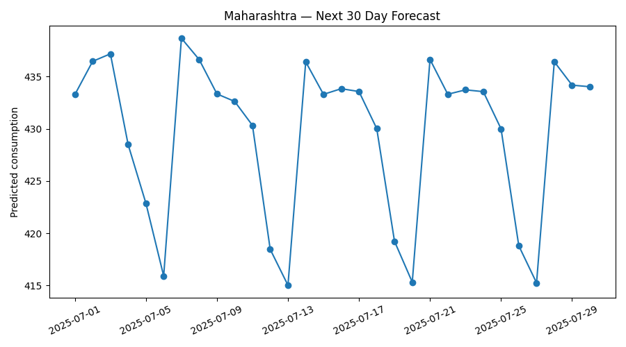
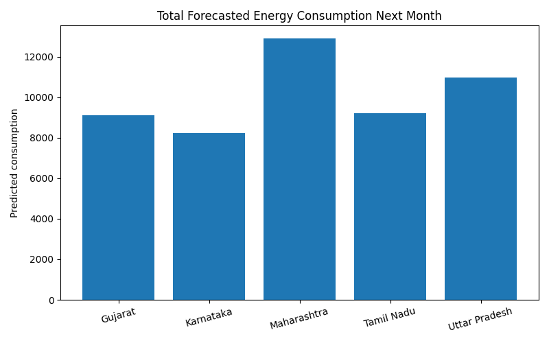

# ⚡ India Energy Demand Forecaster

A machine learning project focused on forecasting electricity demand across five Indian states and estimating total energy consumption for the next month using state-wise time-series forecasting.

---

## 🚀 Project Overview

Electricity demand forecasting plays an important role in power generation planning, grid management, and energy resource allocation.

This project uses historical daily electricity consumption data to build **state-wise forecasting models** for five Indian states.

The model predicts:

- **Next 30 days of daily energy consumption**
- **Total energy consumption for the next month**

The project also includes:

- 📊 Exploratory data analysis
- ⚡ Time-series feature engineering
- 🧠 State-wise machine learning models
- 📈 Forecast visualization
- 💾 Model saving and forecast export

---


## 🎯 Problem Statement

Electricity demand varies due to seasonal effects, weekly consumption patterns, and recent historical usage.

The objective of this project is to use past energy consumption data to estimate future electricity demand at the **state level**.

The forecasting is performed for the following states:

- Maharashtra
- Gujarat
- Tamil Nadu
- Karnataka
- Uttar Pradesh

---

## 📂 Dataset Information

The dataset contains historical daily electricity consumption records for five Indian states.

### Dataset columns

| Column | Description |
|--------|-------------|
| `date` | Daily observation date |
| `state` | State name |
| `consumption_mu` | Daily electricity consumption |

### Source

The current dataset is a sample dataset created for forecasting experiments.

The project can be extended using official data from:

- **Central Electricity Authority (CEA), India**
- **National Power Portal (NPP), India**

---

## 🗂️ Project Structure

```
india-energy-forecaster/
│
├── data/
│   └── india_5_state_energy_sample.csv
│
├── src/
│   ├── train.py
│   └── plot_forecast.py
│
├── models/
│   ├── next_month_forecast.csv
│   └── next_month_total_by_state.csv
│
├── outputs/
│   ├── monthly_total_by_state.png
│   └── maharashtra_next_month_forecast.png
│
├── requirements.txt
├── README.md
└── .gitignore

```
---

# 🖼️ Visualizations

## 📊 Maharashtra



---

## 🔥 Total Forcast



---


## ⚙️ Preprocessing

The raw dataset was prepared using the following steps:

- Converted the `date` column to datetime format
- Sorted records by `state` and `date`
- Created calendar-based features:
  - **day of week**
  - **month**
- Created lag-based features:
  - **lag_1** — previous day consumption
  - **lag_7** — previous week consumption
- Computed **7-day rolling average**
- Removed rows with missing values generated during lag creation

---

## 🧠 Feature Engineering

The forecasting model uses:

- **Day of week**
- **Month**
- **Previous day demand (`lag_1`)**
- **Previous week demand (`lag_7`)**
- **7-day rolling average**

These features help capture short-term consumption behavior and weekly demand patterns.

---

## 🤖 Model Used

### Random Forest Regressor

The project trains **one independent forecasting model per state**.

### Evaluation Metric

**Mean Absolute Error (MAE)**

MAE measures the average prediction error in energy consumption.

---

## 📊 Results

The project successfully generated:

- **30-day daily energy demand forecasts** for each of the five states
- **Total predicted energy consumption for the next month**
- **State-wise forecast visualizations**

### Output files

- `models/next_month_forecast.csv`
- `models/next_month_total_by_state.csv`

### Example monthly forecast

| State | Predicted Next Month Consumption |
|---|---:|
| Maharashtra | 548942.27 |
| Gujarat | 425860.33 |
| Tamil Nadu | 381505.94 |
| Karnataka | 359214.81 |
| Uttar Pradesh | 497331.66 |

The model captured short-term demand trends and generated stable forecasts across all states.

---

## 🔍 Key Observations

- Electricity demand shows clear short-term temporal patterns across states.
- Recent historical consumption (`lag_1`, `lag_7`) strongly influences next-day demand.
- Weekly patterns help capture weekday and weekend demand variation.
- The 7-day rolling average improves forecast stability by smoothing short-term fluctuations.
- Forecasted next-month consumption differs across states because of different demand scales and historical usage patterns.
- State-wise modeling performs better than combining all states into one model.

---

##  Future Improvements

- holiday and festival effects
- larger state coverage
- integration with real government datasets
- interactive Streamlit dashboard

## 👨‍💻 Authors

| Name | Roll Number |
|------|-------------|
| Harshul Goel | 245UAI049 |

---
